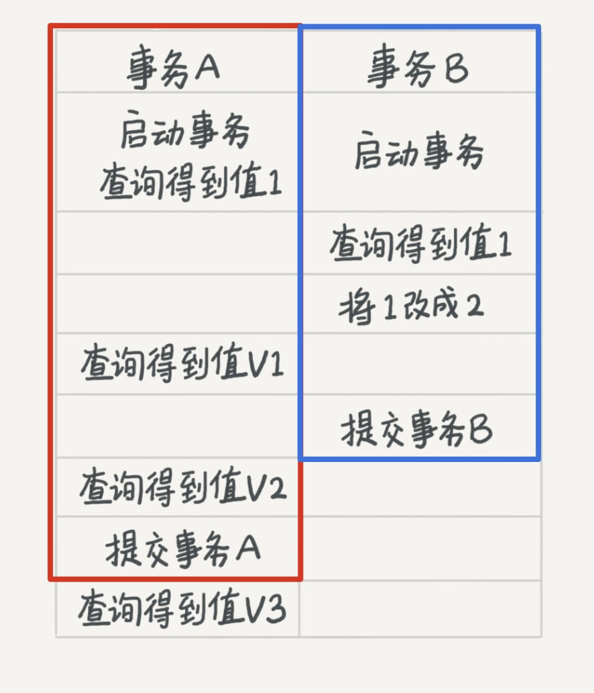

# 事务隔离

[03 | 事务隔离：为什么你改了我还看不见？](https://time.geekbang.org/column/article/115539)

---

事务 ACID（Atomicity、Consistency、Isolation、Durability，即原子性、一致性、隔离性、持久性），隔离性即其中的 Isolation

- 为什么要隔离？

  当数据库上有**多个事务同时执行**的时候，就可能出现脏读（dirty read）、不可重复读（non-repeatable read）、幻读（phantom read）的问题，为了解决这些问题，就有了“隔离级别”的概念
  但同时，隔离得越严实，效率就会越低

## 事务隔离级别

在实现上，数据库里面会创建一个**视图**，访问数据以视图的逻辑结果为准



|          | 读未提交<br />（read uncommitted）         | 读提交<br />（read committed）           | 可重复读<br />（repeatable read）              | 串行化<br />（serializable                                   |
| :------- | ------------------------------------------ | ---------------------------------------- | ---------------------------------------------- | ------------------------------------------------------------ |
|          | 一个事务还没提交时，变更就能被别的事务看到 | 一个事务提交后，变更立刻能被其他事务看到 | 一个事务执行过程中看到的数据与启动时看到的一致 | 对同一行数据操作加锁。后访问的事务必须等前一个事务执行完成，才能继续执行 |
| 视图概念 | 没有视图概念                               | 在每个 SQL 语句开始执行时创建            | 事务启动时创建，整个事务都用同一个视图         | 直接加锁，避免并行访问                                       |
| 例子     | V1=V2=V3=2                                 | V1=1<br />V2=V3=2                        | V1=V2=1<br />V3=2                              | V1=V2=1<br />V3=2<br />A 提交后，B 才可以执行修改            |

---

## 配置事务隔离级别

Oracle 数据库的默认隔离级别其实就是“读提交”，而 MySQL 是“可重复读”，因此对于一些从 Oracle 迁移到 MySQL 的应用，需要修改事务隔离级别

```mysql
# 将启动参数 transaction-isolation 的值设置成 READ-COMMITTED

show variables like 'transaction_isolation';

# +-----------------------+----------------+

# | Variable_name | Value |

# +-----------------------+----------------+

# | transaction_isolation | READ-COMMITTED |

# +-----------------------+----------------+
```

## 事务的启动方式 

- set autocommit=1，（手动 begin 或 start transaction） + （手动 commit 或 rollback）
  明确事务范围，但语句繁琐
- set autocommit=0，（自动 begin）+  （手动 commit ）
  事务自动开启，但可能导致意外的长事务
- set autocommit=1 + **commit work and chain**
  （手动 begin）+  （commit 提交 /  commit work and chain 提交事务并自动启动下一个事务）
  省去了再次执行 begin 语句的开销，同时明确地知道每个语句是否处于事务中