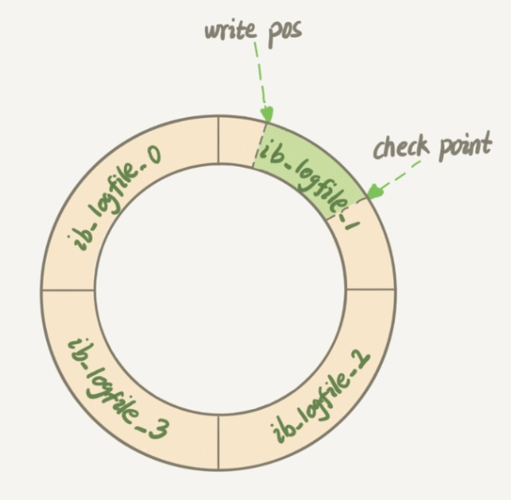

# 更新语句的执行过程

[02 | 日志系统：一条SQL更新语句是如何执行的？](https://time.geekbang.org/column/article/115538)

---

## 更新过程

对于表：

```mysql
 create table T(ID int primary key, c int);
```

更新语句写法：

```mysql
update T set c=c+1 where ID=2;
```

执行过程：

1. 连接器连接数据库
2. 把表 T 上所有缓存结果都清空
3. 分析器通过词法、语法解析知道这是一条更新语句
4. 优化器决定要使用 ID 这个索引
5. 执行器负责具体执行，找到这一行，然后更新。❗️更新流程涉及两个重要的日志模块
   - redo log（重做日志）：数据库引擎层
   - binlog（归档日志）：server层

## 执行器过程：两阶段提交 

1. （执行器从引擎）取出数据
   执行器找引擎取 ID=2 这一行。ID 是主键，引擎直接用**树搜索**找到这一行。
   如果 ID=2 **这一行所在的数据页**在内存中，就直接返回给执行器；否则，需要先**从磁盘读入内存**，然后再返回。 
2. （执行器）更新数据
   执行器拿到引擎给的行数据，把这个值加上 1，得到新的一行数据，再调用引擎接口写入这行新数据。 
3. （引擎）更新redo log
   引擎将这行新数据**更新到内存**中，同时将这个更新操作记录到 redo log 里面，此时 redo log 处于**prepare**状态。然后告知执行器执行完成了，随时可以提交事务。
4. （执行器）更新binlog
   执行器生成这个操作的 binlog，并**把 binlog 写入磁盘** 
5. （引擎）提交redo log
   执行器调用引擎的提交事务接口，引擎把刚刚写入的 redo log 改成提交（commit）状态，更新完成。

## redo log

- 是什么：redo log 是 InnoDB 引擎独有的日志系统，不属于MySQL。(MySQL 自带的引擎是 MyISAM，但是 MyISAM 没有 crash-safe 的能力)
  记录的是物理日志

- 为什么：redo log 是为了 InnoDB 引擎实现 crash-safe能力

### WAL技术

WAL  ( Write-Ahead Logging ) ：先写日志，再写磁盘

1. 一条数据需要更新时，InnoDB 引擎会先把记录写到 redo log里面，并**更新内存**，这个时候更新就算完成了
2. 在系统比较空闲的时候，InnoDB 引擎会将操作记录**更新到磁盘**里面

### 循环记录

redo log 是固定大小的（比如配置为一组 4 个文件，每个文件的大小是 1GB，那么总共就可以记录 4GB 的操作）
从头开始写，写到末尾就又回到开头循环写



[write pos, check point] 间可以写入新纪录
write pos 向前：向日志中写入更新记录
check point 向前：向磁盘中写入更新记录，并擦除日志中的记录

当 write pos > check point 时，必须停下新的更新操作，先将日志更新到磁盘

### crash-safe能力

crash-safe 是指系统发生异常重启后，之前提交的记录不会丢失

使用redo log记录更新的日志，InnoDB 就有了 crash-safe 能力。重启系统后，仍然能将redo log中的记录更新到磁盘

## 日志区别

- redo log 是 InnoDB 引擎特有的；binlog 是 MySQL 的 Server 层实现的，所有引擎都可以使用。

- redo log 是物理日志，记录的是“在某个数据页上做了什么修改”；binlog 是逻辑日志，记录的是这个语句的原始逻辑，比如“给 ID=2 这一行的 c 字段加 1 ”。 
- redo log 是循环写的，空间固定会用完；binlog 是“追加写”，并不会覆盖以前的日志