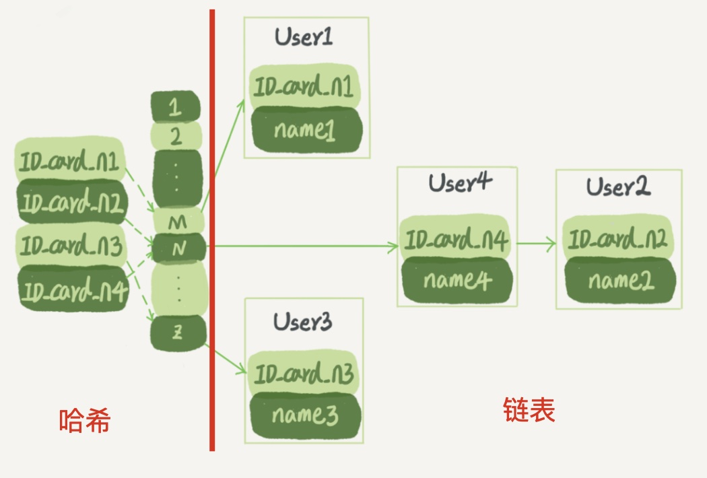
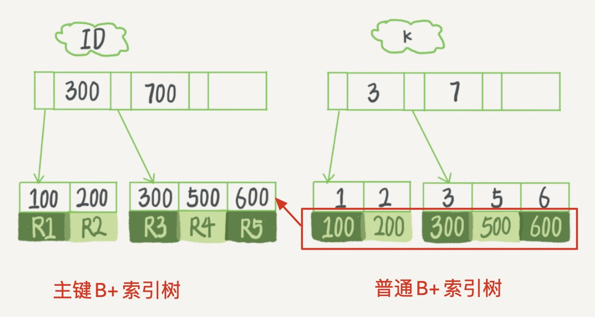

# 索引

- 为什么要用索引？

  索引就是为了提高数据查询的效率，借助 "目录" ，快速找到内容

- 

## 索引的数据结构

|      | 哈希链表           | 数组             | 树           |
| ---- | ------------------ | ---------------- | ------------ |
| 优点 | 插入快             | 区间、普通搜索快 | 插入、查找快 |
| 缺点 | 区间查找慢，适合存 | 插入慢，适合查   |              |

### 哈希链表

- 哈希

  以键 - 值（key-value）存储数据的结构，输入 key 就可以找到对应的 Value (相当于给数组每个位置设置了名字)
  **哈希函数**把 key 换算成一个确定的位置，然后把 value 放在数组的这个位置

  - 问题
    多个 key 值经过哈希函数的换算，会出现同一个值的情况
    处理这种情况的一种方法是拉出一个链表

- 链表

  哈希换算后的值后面还跟了一个链表
  对于哈希换算后值相同的数，按顺序遍历链表，找到所需项

- 总结：
  ✔️ 数据不按主键顺序存放，加入新项时速度会比较快
  ✖️ 但同时对范围查找相当不友好

### 有序数组

✔️ 用二分法可以快速搜索，时间复杂度是 O(log(N))

✔️ 支持范围查询：要查在 [a, b] 区间的值，可以先用二分法找到 a（如果不存在 a，就找到 >a 的第一个值），然后向右遍历，直到查到第一个 >b 的值，退出循环。

✖️ 更新数据时，往中间插入一个记录就必须得挪动后面所有的记录，成本太高

### 树

- 二叉树

  每个节点的左儿子 < 父节点 < 右儿子，查找的时间复杂度是 O(log(N))

  搜索效率最高，但层数太多，数据块分层太多，导致多次读取磁盘

- N叉树：叶子数 = $N^{(层数-1)}$

树根的数据块总是在内存中的，减少访问磁盘的次数

## InnoDB 的索引模型

InnoDB 使用了 B+ 树索引模型，表根据主键索引存放的。B+ 数的叶子节点存放数据，所有父节点存放索引。

每一个索引在 InnoDB 里面对应一棵 B+ 树

### 索引类型

- 主键索引 = 聚簇索引（clustered index），叶子节点存整行数据

  使用主键 ID 查询，只需要搜索 ID 这棵 B+ 树

- 非主键索引 = 二级索引（secondary index），叶子节点存主键的值 

  使用普通索引查询，需要先搜索 k 索引树，得到 ID 的值为 500，再到 ID 索引树搜索一次。这个过程称为**回表**

❗️显然，主键长度越小，普通索引的叶子节点就越小，普通索引占用的空间也就越小

### 索引维护

在插入、删除数据时，表的索引需要修改维护

- 页分裂问题

  如果 R5 所在的数据页满了，又要在其后插入新数据，这时候需要申请一个新的数据页，然后挪动部分数据过去

  在这种情况下，性能会受影响，还影响数据页的利用率。原本放在一个页的数据，现在分到两个页中，整体空间利用率降低大约 50%

  - ❗️解决办法：采用**自增字段主键**

    `NOT NULL PRIMARY KEY AUTO_INCREMENT`

    自增主键往往是整型数字，而非业务逻辑字段

    保证每次插入一条新记录，都是追加操作，不挪动其他记录，也不会触发叶子节点的分裂

    

### 覆盖索引

使非主键索引覆盖查询需求 (使用联合索引)，避免回表。

### 最左前缀原则

最左前缀就是，有了 (a,b) 这个联合索引后，就不需要单独在 a 上建立索引了。

调整联合索引的顺序，少维护一个索引，或者建立的索引占用空间更小

## 准则

尽量使用主键查询，避免回表

使用自增主键，减少表维护产生的页分裂

主键长度尽量小，减小非主键索引占用的空间

使用覆盖索引

通过最左前缀原则，减少索引树个数，或是压缩索引空间

